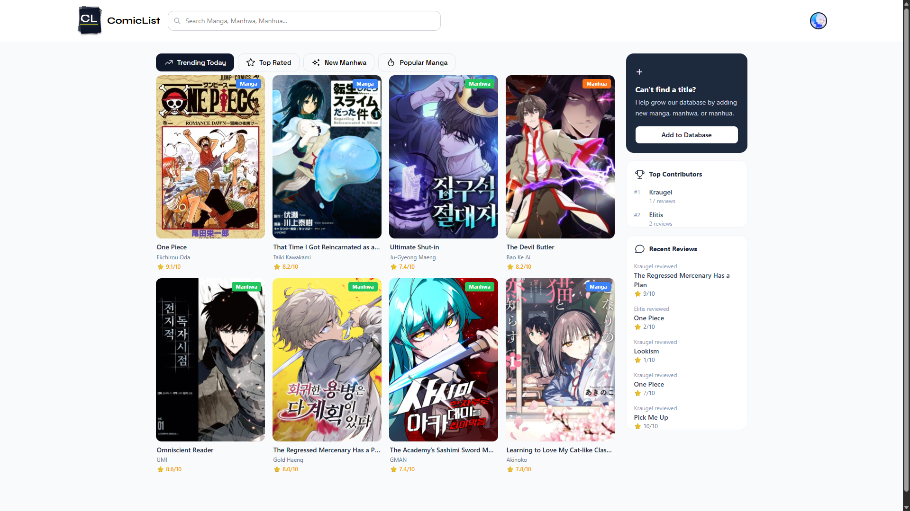
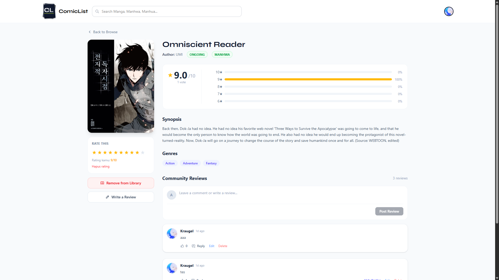
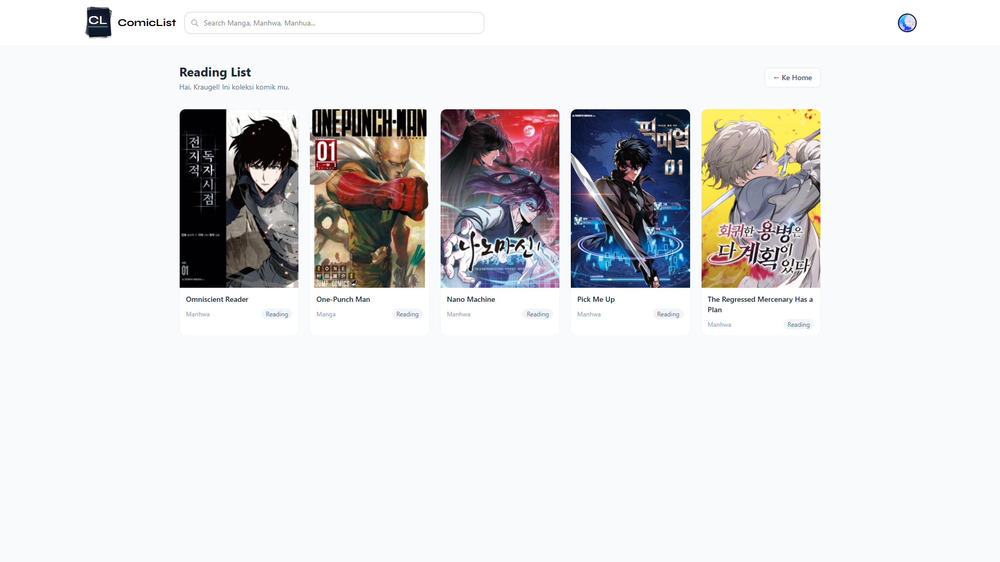

# 📚 ComicList

A web platform to track and explore your favorite manga, manhwa, and manhua — built with React + TypeScript + Supabase.

🔗 **Live Demo:** [comic-list.vercel.app](https://comic-list.vercel.app/)

---

## 📸 Screenshots

### Homepage


### Comic Detail


### Reading List


---

## ✨ Features

- **Browse Comics** — Explore manga/manhwa/manhua by category: Trending Today, Top Rated, New Manhwa, and Popular Manga
- **Real-time Search** — Search titles from AniList API and the manual database, directly from the navbar
- **Comic Detail Page** — Full info per comic: synopsis, genres, author, status, and rating distribution
- **Rating System** — Rate each comic 1–10 stars, editable or deletable anytime
- **Community Reviews** — Comment, reply, and like other users' reviews
- **Reading List / Library** — Save comics to your personal collection with a reading status
- **Add Comics** — Search from AniList or manually upload with a custom cover image
- **User Profile** — Edit profile picture, view username and email
- **Authentication** — Register and login via email + password (Supabase Auth)
- **Top Contributors & Recent Reviews** — Sidebar highlighting the most active community members

---

## 🛠 Tech Stack

| Layer | Technology |
|---|---|
| Frontend | React 19, TypeScript, Vite |
| Styling | Tailwind CSS v4 |
| Backend & Auth | Supabase (PostgreSQL + Storage + Realtime) |
| External API | AniList GraphQL API |
| Deployment | Vercel |
| Fonts | Plus Jakarta Sans, Syne, Space Grotesk |

---

## 📁 Project Structure

```
comiclist/
├── docs/                       # Screenshots for README
│   ├── homepage.png
│   ├── detailcomic.png
│   └── reading_list.png
├── public/
│   ├── ComicList-logoFix.svg
│   └── favicon.svg
├── src/
│   ├── assets/
│   │   └── ComicList-logoFix.svg
│   ├── components/
│   │   ├── AddComicModal.tsx   # Add comic modal (AniList search / manual upload)
│   │   ├── Auth.tsx            # Login & register page
│   │   ├── ComicDetail.tsx     # Comic detail page + rating + comments
│   │   ├── Dashboard.tsx       # User reading list
│   │   ├── HomePage.tsx        # Main page + browse tabs
│   │   ├── Navbar.tsx          # Navbar + search + dropdown menu
│   │   └── Profile.tsx         # User profile editor
│   ├── lib/
│   │   ├── anilist.ts          # AniList GraphQL API fetcher
│   │   ├── queries.ts          # All GraphQL queries
│   │   ├── supabaseClient.ts   # Supabase client initialization
│   │   └── utils.ts            # Helpers: getAuthor, cleanDescription, etc.
│   ├── styles/
│   │   └── comic.css           # Custom CSS: grid, card, skeleton, tabs
│   ├── types/
│   │   └── index.ts            # Global type definitions
│   ├── App.css                 # Font imports + Tailwind
│   ├── App.tsx                 # Root component + simple routing
│   ├── index.css
│   └── main.tsx
├── .gitignore
├── eslint.config.js
├── index.html
├── package.json
├── tsconfig.app.json
├── tsconfig.json
├── tsconfig.node.json
└── vite.config.ts
```

---

## 🚀 Getting Started

### 1. Clone the repo

```bash
git clone https://github.com/username/comiclist.git
cd comiclist
```

### 2. Install dependencies

```bash
npm install
```

### 3. Set up environment variables

Create a `.env` file in the project root:

```env
VITE_SUPABASE_URL=https://your-project.supabase.co
VITE_SUPABASE_ANON_KEY=your-anon-key
```

> You can find these values in your Supabase project dashboard under **Settings → API**.

### 4. Run the dev server

```bash
npm run dev
```

Open in browser: `http://localhost:5173`

---

## 🗄 Database Schema (Supabase)

### `comics`
| Column | Type | Description |
|---|---|---|
| id | uuid | Primary key |
| title | text | Comic title |
| synopsis | text | Short synopsis |
| cover_url | text | Cover image URL |
| author | text | Writer/artist name |
| type | text | `manga`, `manhwa`, or `manhua` |
| status | text | `RELEASING`, `FINISHED`, etc. |
| genres | text[] | Array of genres (optional) |
| external_id | int | AniList ID (null = manual upload) |
| created_by | uuid | User who added it (FK → auth.users) |

### `ratings`
| Column | Type | Description |
|---|---|---|
| id | uuid | Primary key |
| user_id | uuid | FK → profiles |
| comic_id | uuid | FK → comics |
| score | int | Score from 1–10 |

### `comments`
| Column | Type | Description |
|---|---|---|
| id | uuid | Primary key |
| user_id | uuid | FK → profiles |
| comic_id | uuid | FK → comics |
| content | text | Comment body |
| parent_id | uuid | FK → comments (null = top-level) |

### `comment_likes`
| Column | Type | Description |
|---|---|---|
| id | uuid | Primary key |
| user_id | uuid | FK → profiles |
| comment_id | uuid | FK → comments |

### `user_library`
| Column | Type | Description |
|---|---|---|
| id | uuid | Primary key |
| user_id | uuid | FK → profiles |
| comic_id | uuid | FK → comics |
| status | text | User's reading status |

### `profiles`
| Column | Type | Description |
|---|---|---|
| id | uuid | FK → auth.users |
| username | text | Username |
| avatar_url | text | Profile picture URL |

### Storage Buckets
- `avatars` — User profile pictures
- `comic-covers` — Cover images for manually uploaded comics

---

## 📜 Scripts

```bash
npm run dev       # Start development server
npm run build     # Build for production
npm run preview   # Preview production build
npm run lint      # Run ESLint
```

---

## 🌐 External API

This project uses the **AniList GraphQL API** (free, no API key required) to:
- Fetch trending, top rated, new manhwa, and popular manga
- Search titles from the AniList database
- Retrieve comic details (cover, synopsis, genres, staff)

Endpoint: `https://graphql.anilist.co`

---

## 📌 Notes

- Comics added via AniList are upserted into Supabase so ratings and comments can be stored
- Manually uploaded comics (no `external_id`) are accessed directly via UUID
- Realtime updates are active on the comic detail page — ratings, comments, and likes update automatically without refreshing

---

## 👤 Author

Built by **Anas F.**